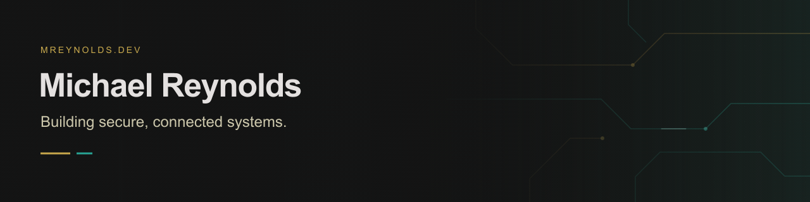
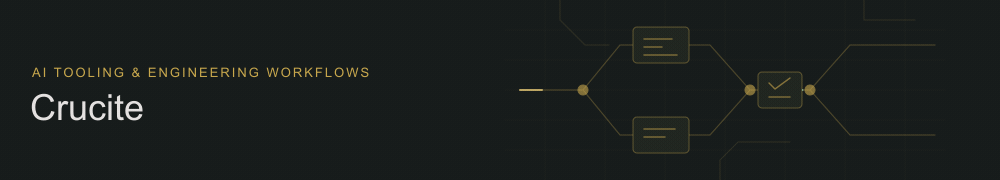
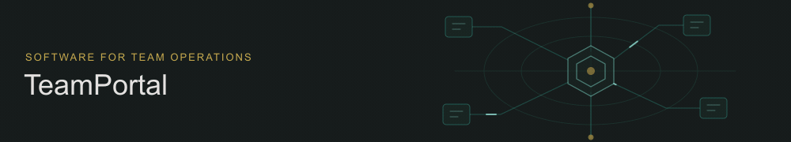
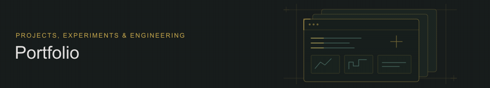

I build software that connects people, services, and operations. My work focuses on AI integrations, automation, and DevSecOps.

[Portfolio ↗](https://mreynolds.dev) · [Résumé ↗](https://mreynolds.dev/resume) · [LinkedIn ↗](https://linkedin.com/in/mcreynolds-dev)

## Selected work

### Crucite

A personal engineering platform for AI integrations, automation, and governed software delivery.

Focus · Tool access, engineering standards, and delivery workflows.

[Explore the project ↗](https://mreynolds.dev/projects/crucite)

### TeamPortal

A managed platform for FIRST robotics teams, connecting member access, forms, events, and team operations.

Focus · Tenant boundaries, integrations, and clear member workflows.

### Portfolio

My portfolio of software projects and experiments, built around the work and the decisions behind it.

Focus · Clear project stories and a consistent visual identity.

[Visit the portfolio ↗](https://mreynolds.dev)

More projects, experiments, and background at [mreynolds.dev ↗](https://mreynolds.dev).
